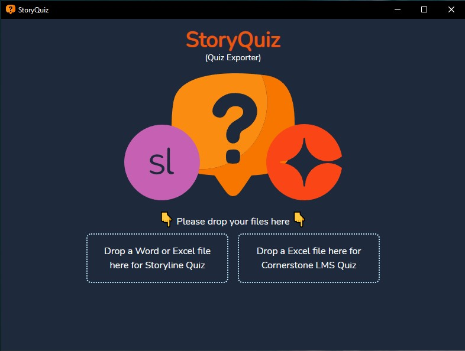

# Storyline Quiz - Text Format

Scans for questions in Word or Excel files (specific to my org) and writes them to a format that can be used by Articulate Storyline or Cornerstone LMS to create quizzes in that respective platform.

-   Easily drag multiple word or excel files into a drop zone to scan and export questions.
-   Shows app info when logo is clicked.
-   Displays license info when license is clicked.

## Tech Stack

-   Go
-   Vite
-   Wails
-   Svelte
-   TypeScript
-   Tailwind CSS



## Go / Wails

-   Setup

    ```sh
    ## windows
    scoop install go
    go install github.com/wailsapp/wails/v2/cmd/wails@latest

    ## arch
    paru -S go
    export PATH="$PATH:$(go env GOBIN):$(go env GOPATH)/bin"
    go install github.com/wailsapp/wails/v2/cmd/wails@latest

    paru -Sy
    paru -S gtk3 webkit2gtk
    ```

-   Install

    ```sh
    wails init -n storyquiz -t svelte-ts
    ```

-   Build
    ```sh
    wails build
    wails build -platform windows # for cross platform build on linux
    ```
    -   linux executable: `./build/bin/storyquiz`
    -   windows executable: `./build/bin/storyquiz.exe`
